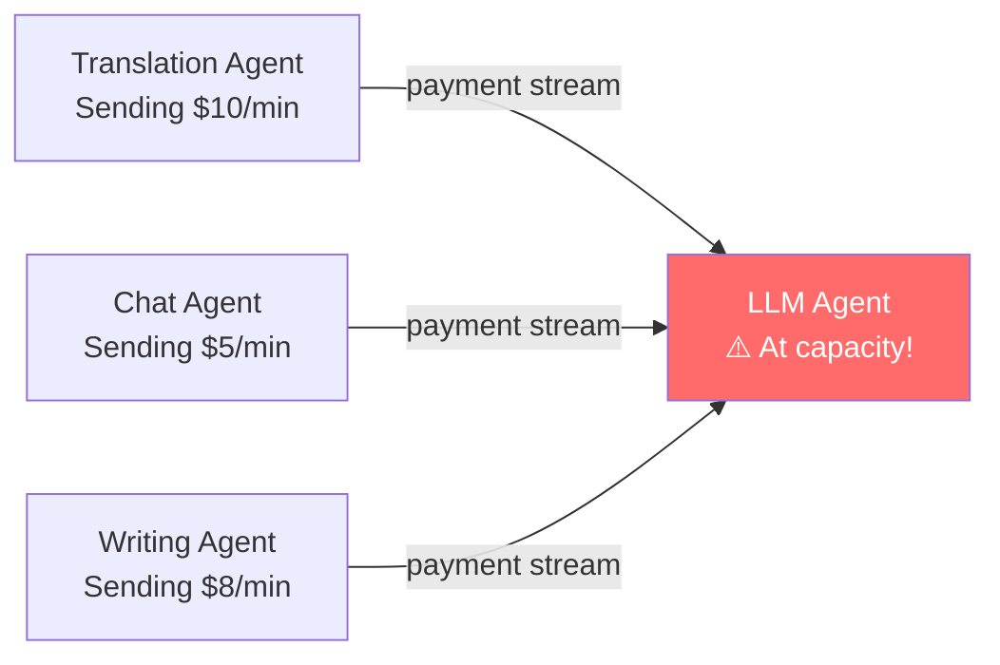
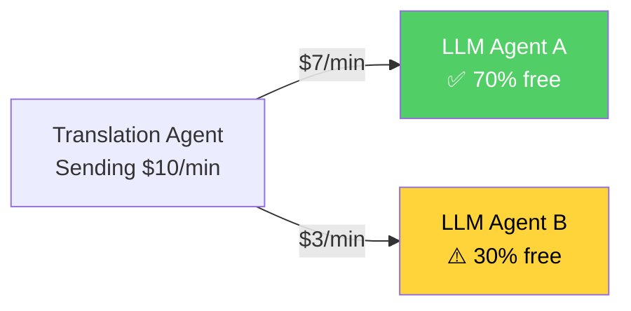
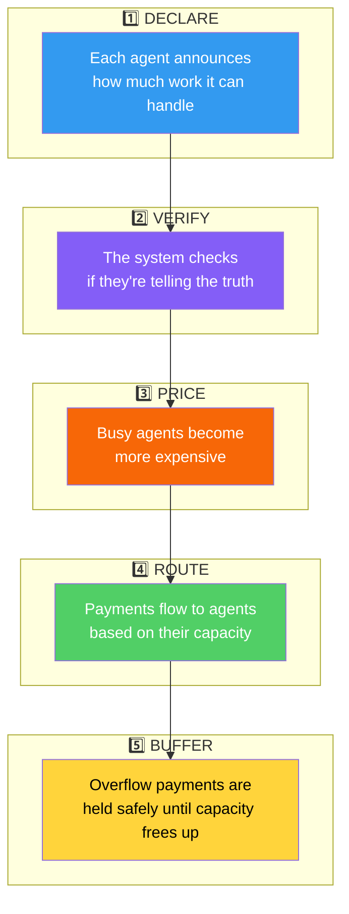
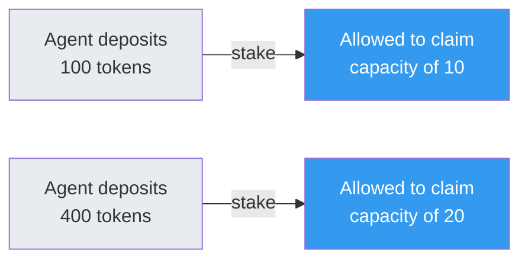
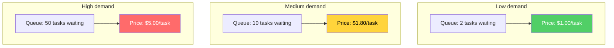
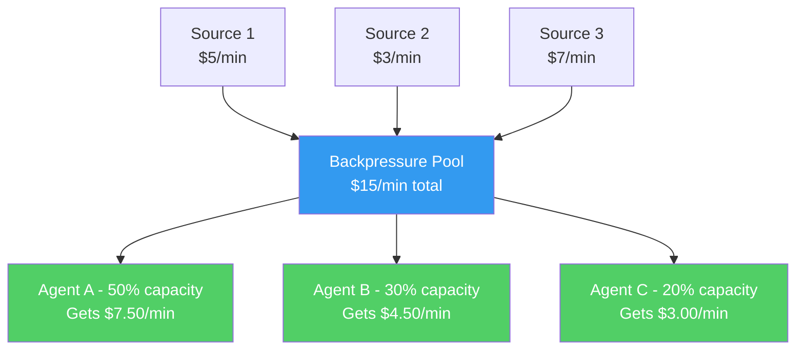
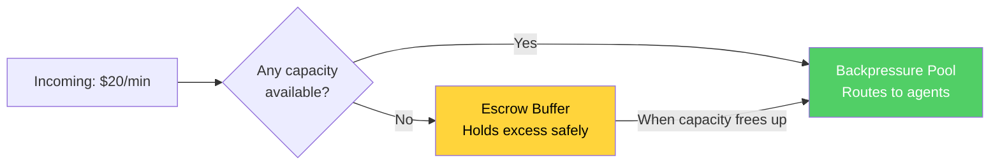
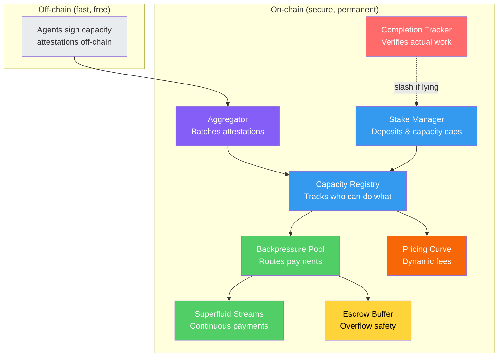

# How BPE Works - The Plain-Language Guide

**No math degree required.** This page explains Backpressure Economics (BPE) from scratch, with pictures.

---

## The Problem: AI Agents Need to Pay Each Other

Imagine a world where AI agents do work for each other - and pay with cryptocurrency in real-time, streaming tiny amounts every second, like a running meter.

- A **translation agent** pays an **LLM agent** to generate text
- A **photo app** pays an **image generation agent** to create pictures
- A **search agent** pays an **embedding agent** to understand text

These payments flow continuously, like water through pipes.

**But here's the problem:** what happens when an agent gets too busy?

The LLM agent can only handle so much work. But the money keeps flowing in, whether the work gets done or not. It's like paying for a restaurant meal that never arrives because the kitchen is overwhelmed.

**In data networks, this is a solved problem** - routers drop packets or reroute traffic when links are congested. But in payment networks? No one has built this. That's what BPE does.

---

## The Solution: Backpressure Routing for Money

BPE borrows a brilliant idea from how the internet works: **backpressure routing**. The core idea is simple:

> **Send more money to the agents who have the most spare capacity.**

When Agent A has lots of spare capacity, it gets a bigger share of the payments. When Agent B is almost full, it gets less. The system automatically reroutes money toward whoever can actually do the work.

---

## How Does It Actually Work?

There are five key ideas, and they form a pipeline:

Let's walk through each one.

---

### 1️⃣ Declare: "Here's How Much I Can Handle"

Every AI agent that wants to receive payments (**called a "sink"**) tells the network how much work it can process. Think of it like a restaurant posting how many tables are open.

But there's a catch - agents might lie to get more money. So declarations go through two safeguards:

**Stake to play.** Every agent must put down a deposit (like a security deposit on an apartment). The more you deposit, the more capacity you're allowed to claim. This prevents someone from creating a thousand fake agents to steal payments.

Notice something? Depositing 4x more only gives you 2x more capacity. This is by design - it makes the "create fake identities" attack unprofitable.

**Commit-reveal.** Agents don't just blurt out their capacity. They first submit a sealed commitment (like a sealed auction bid), then reveal the actual number later. This prevents other agents from seeing your number and gaming the system.

---

### 2️⃣ Verify: "Prove You Actually Did the Work"

Declaring capacity is one thing. Actually doing the work is another. BPE has a built-in lie detector:

Every completed task produces a **dual-signed receipt** - both the agent doing the work AND the agent requesting it must sign off. The blockchain counts these receipts and compares them to what the agent *claimed* it could do.

**If an agent claims it can handle 100 tasks per period but only completes 40?** After three bad periods in a row, 10% of its deposit gets taken away. This makes lying about capacity a losing strategy.

---

### 3️⃣ Price: Busy Agents Cost More

Just like Uber's surge pricing, BPE makes busy agents more expensive:

The price has two parts:

- **Base fee** - goes up when demand is high across the board (like gas prices during a shortage)
- **Queue premium** - goes up for a specific agent when their personal queue is long

This naturally pushes demand toward agents that have spare capacity, because they're cheaper.

---

### 4️⃣ Route: Money Flows Where Capacity Is

This is the magic step. A smart contract called the **Backpressure Pool** collects all incoming payment streams and redistributes them automatically.

The pool divides money in proportion to each agent's verified capacity. Agents with more verified capacity get a bigger slice. This happens **automatically and continuously** - no middleman, no manual intervention.

When capacity changes (an agent gets busier, or a new agent joins), anyone can trigger a **rebalance** to update the split.

---

### 5️⃣ Buffer: A Safety Net for Overflow

What if ALL agents are at capacity and money keeps coming in? Instead of losing it, BPE holds it in an **escrow buffer** - like a waiting room.

When capacity frees up, the buffer drains automatically. If the buffer itself fills up, sources get a clear signal: stop sending until things clear up.

---

## The Big Picture

Here's how all the pieces fit together in one view:

---

## Why Should I Care?

BPE matters because AI agents are starting to transact with each other autonomously - paying for compute, data, and services without humans in the loop. Today's payment systems can't handle this:

| Problem | Traditional Payments | BPE |
|---------|---------------------|-----|
| Agent gets overwhelmed | Money wasted, work unfinished | Money reroutes to available agents |
| Agent lies about capacity | No way to know | Automatic detection and penalty |
| New agent joins | Manual integration | Permissionless - just stake and register |
| Demand spikes | System breaks | Prices rise, demand balances naturally |
| Agent goes offline | Payments lost | Buffer holds funds, pool rebalances |

---

## Glossary

| Term | Plain English |
|------|--------------|
| **Sink** | An AI agent that receives payment for doing work |
| **Source** | An app or agent that pays for work to be done |
| **Task type** | A category of work (e.g., "text generation", "image creation") |
| **Capacity** | How much work an agent can handle at once |
| **Stake** | A security deposit agents put down to participate |
| **Slash** | Penalty - taking part of an agent's deposit for bad behavior |
| **EWMA** | A smoothing method that prevents sudden, suspicious capacity changes |
| **Rebalance** | Updating how payments are split based on current capacity |
| **Epoch** | A time window (5 minutes) for measuring agent performance |
| **Stream** | A continuous payment flow (like a salary paid every second) |
| **GDA** | General Distribution Agreement - Superfluid's tech for splitting a stream among multiple recipients |

---

## Want to Go Deeper?

- **[Paper - Introduction](paper/introduction.md)** - the academic version, with formal proofs
- **[Protocol Design](paper/protocol.md)** - technical details of each smart contract
- **[Implementation](implementation/contracts.md)** - the actual Solidity code, deployed on Base Sepolia
- **[SDK](implementation/sdk.md)** - build with BPE in TypeScript
