# How BPE Works (The Plain-Language Guide)

**No math degree required.** This page explains Backpressure Economics (BPE) from scratch, with pictures.

---

## The Problem: AI Agents Need to Pay Each Other

Imagine a world where AI agents do work for each other and pay with cryptocurrency in real-time, streaming tiny amounts every second, like a running meter.

- A **translation agent** pays an **LLM agent** to generate text
- A **photo app** pays an **image generation agent** to create pictures
- A **search agent** pays an **embedding agent** to understand text

These payments flow continuously, like water through pipes.

**But here's the problem:** what happens when an agent gets too busy?

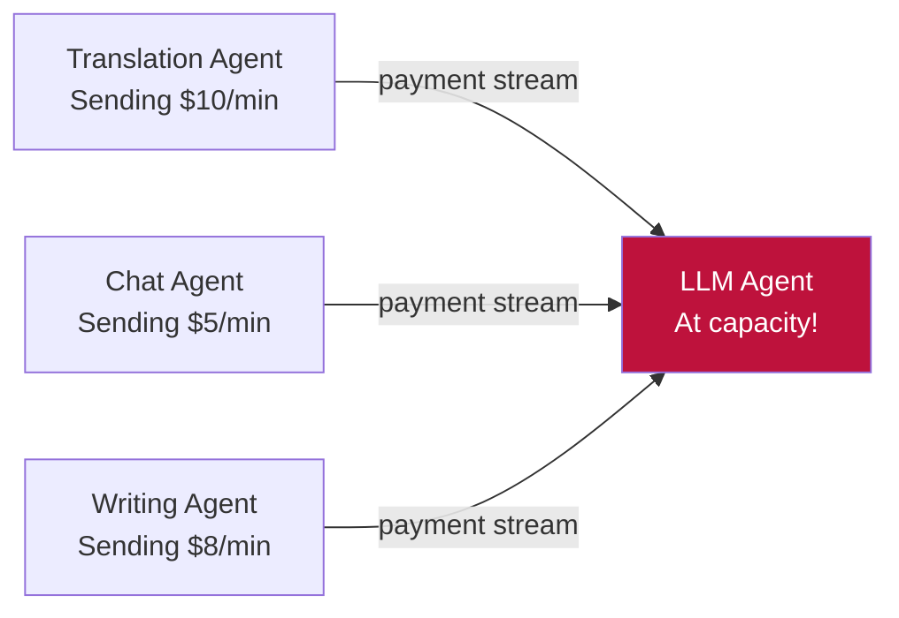

The LLM agent can only handle so much work. But the money keeps flowing in, whether the work gets done or not. It's like paying for a restaurant meal that never arrives because the kitchen is overwhelmed.

**In data networks, this is a solved problem.** Routers drop packets or reroute traffic when links are congested. But in payment networks? No one has built this. That's what BPE does.

---

## Wait, Why Does This Need Crypto?

Fair question. If you're coming from the AI/ML world, you might wonder why any of this involves a blockchain. Here's the short version: **BPE needs programmable money that no single party controls.**

### The properties that matter

**Streaming payments.** Agents need to pay each other continuously, not in lump sums. A translation agent pays an LLM agent a tiny amount every second the work is happening. This requires a payment system that supports real-time, per-second flows. That's what [Superfluid](https://www.superfluid.finance/) does: it's a protocol for continuous token streams, where balances update every block without requiring a transaction for each payment.

**Programmable routing.** The core of BPE is a [smart contract](https://en.wikipedia.org/wiki/Smart_contract) that automatically splits incoming payment streams based on capacity data. Nobody has to approve the split. Nobody can censor it. The rules are in the code, and the code runs on a public blockchain where anyone can verify it. Try getting Stripe or PayPal to programmatically reroute payments to whichever AI agent has the most spare CPU.

**No platform risk.** If your agent economy depends on a company's API, that company can change the rules, raise fees, or shut down. Smart contracts on a blockchain are permissionless: once deployed, they run exactly as written. No terms of service. No API key revocations.

**Composability.** Every contract on the network can call every other contract. BPE's routing pools can plug into lending protocols, insurance contracts, or any other on-chain system without needing an integration partner. This means new domains (Lightning channels, Nostr relays, anything else) can plug into the same capacity infrastructure without anyone's permission.

### Key concepts (quick glossary for developers)

| Concept | What it is | Why BPE needs it |
|---------|-----------|------------------|
| **Token** | A programmable unit of value on a blockchain, like a digital dollar that code can move | Payments between agents are denominated in tokens |
| **Smart contract** | A program that lives on a blockchain and executes automatically when conditions are met | BPE's routing, pricing, and verification logic are all smart contracts |
| **Staking** | Locking up tokens as a security deposit | Agents stake tokens to declare capacity; dishonesty costs them their deposit |
| **Streaming payments** | Continuous per-second token flows (not batch transfers) | Agents get paid in real time, proportional to work done |
| **Layer 2 (L2)** | A faster, cheaper blockchain that inherits security from a main chain | BPE runs on Base (an L2), so transactions cost fractions of a cent |
| **Gas** | The fee paid for each blockchain transaction | On Base L2, gas costs are low enough for frequent capacity updates |

### Where does BPE run?

BPE is deployed on **[Base](https://base.org)**, an Ethereum [Layer 2](https://en.wikipedia.org/wiki/Blockchain_layer_2) network built by Coinbase. Base inherits Ethereum's security guarantees while offering transaction fees under $0.01 and confirmation times around 2 seconds. This makes it practical for the frequent capacity updates, rebalancing, and attestation submissions that BPE requires.

You don't need to understand Ethereum's internals to use BPE. The [TypeScript SDK](https://github.com/backproto/backproto/tree/main/sdk) abstracts the blockchain interaction into straightforward function calls like `registerSink()`, `getPrice()`, and `rebalance()`.

---

## The Solution: Backpressure Routing for Money

BPE borrows a brilliant idea from how the internet works: **[backpressure routing](https://en.wikipedia.org/wiki/Backpressure_routing)**. The core idea is simple:

> **Send more money to the agents who have the most spare capacity.**

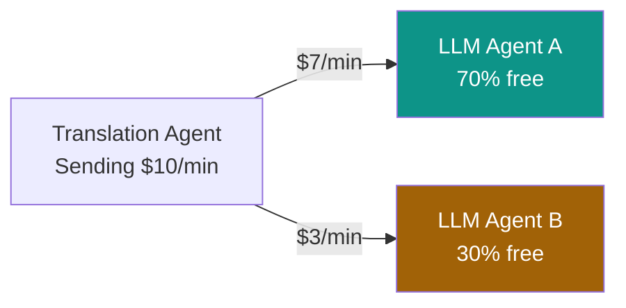

When Agent A has lots of spare capacity, it gets a bigger share of the payments. When Agent B is almost full, it gets less. The system automatically reroutes money toward whoever can actually do the work.

---

## How Does It Actually Work?

There are five key ideas, and they form a pipeline:

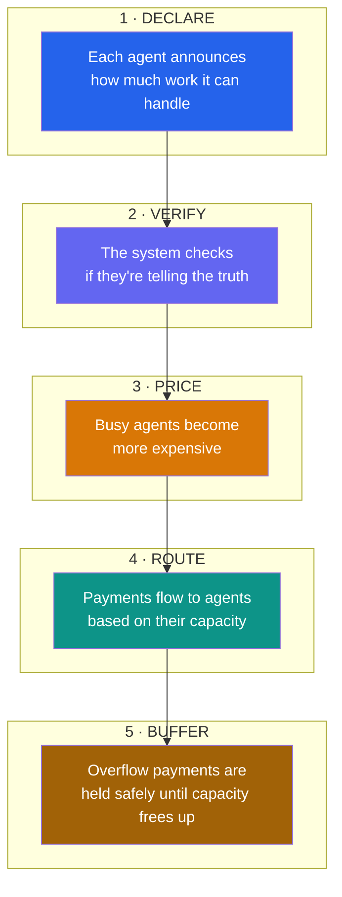

Let's walk through each one.

---

### 1. Declare: "Here's How Much I Can Handle"

Every AI agent that wants to receive payments (**called a "sink"**) tells the network how much work it can process. Think of it like a restaurant posting how many tables are open.

But there's a catch: agents might lie to get more money. So declarations go through two safeguards:

**Stake to play.** Every agent must put down a deposit (like a security deposit on an apartment). The more you deposit, the more capacity you're allowed to claim. This prevents someone from creating a thousand fake agents to steal payments (a [Sybil attack](https://en.wikipedia.org/wiki/Sybil_attack)).

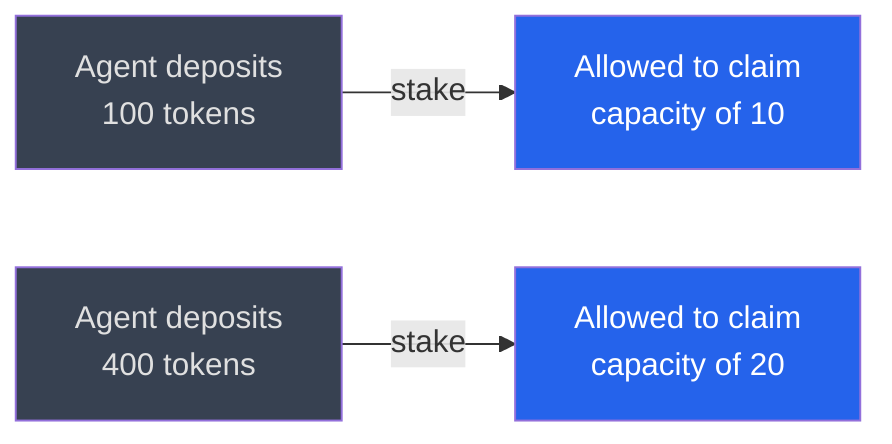

Notice something? Depositing 4x more only gives you 2x more capacity. This is by design. It makes the "create fake identities" attack unprofitable.

**[Commit-reveal](https://en.wikipedia.org/wiki/Commitment_scheme).** Agents don't just blurt out their capacity. They first submit a sealed commitment (like a sealed auction bid), then reveal the actual number later. This prevents other agents from seeing your number and gaming the system.

---

### 2. Verify: "Prove You Actually Did the Work"

Declaring capacity is one thing. Actually doing the work is another. BPE has a built-in lie detector:

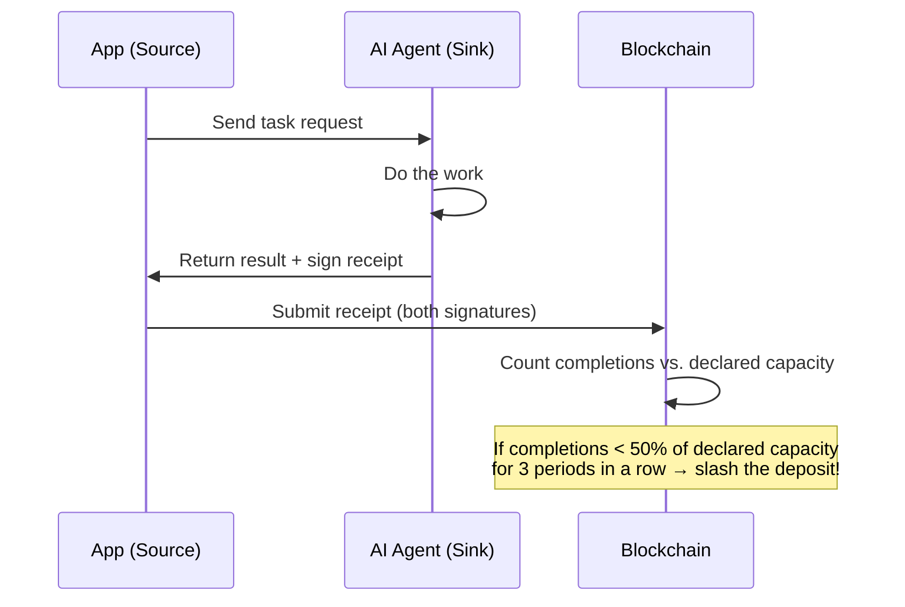

Every completed task produces a **dual-signed receipt**: both the agent doing the work AND the agent requesting it must sign off. The blockchain counts these receipts and compares them to what the agent *claimed* it could do.

**If an agent claims it can handle 100 tasks per period but only completes 40?** After three bad periods in a row, 10% of its deposit gets taken away. This makes lying about capacity a losing strategy.

---

### 3. Price: Busy Agents Cost More

Just like Uber's [surge pricing](https://en.wikipedia.org/wiki/Dynamic_pricing), BPE makes busy agents more expensive:

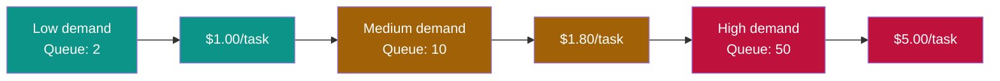

The price has two parts:

- **Base fee:** goes up when demand is high across the board (like gas prices during a shortage)
- **Queue premium:** goes up for a specific agent when their personal queue is long

This naturally pushes demand toward agents that have spare capacity, because they're cheaper.

---

### 4. Route: Money Flows Where Capacity Is

This is the magic step. A smart contract called the **Backpressure Pool** collects all incoming payment streams and redistributes them automatically.

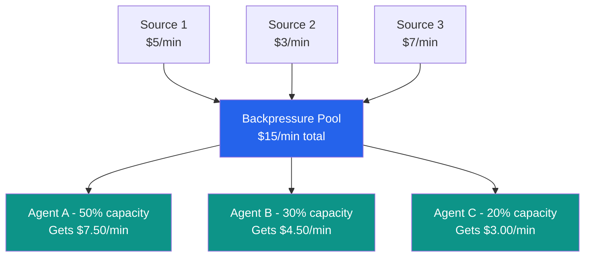

The pool divides money in proportion to each agent's verified capacity. Agents with more verified capacity get a bigger slice. This happens **automatically and continuously**, with no middleman, no manual intervention.

When capacity changes (an agent gets busier, or a new agent joins), anyone can trigger a **rebalance** to update the split.

---

### 5. Buffer: A Safety Net for Overflow

What if ALL agents are at capacity and money keeps coming in? Instead of losing it, BPE holds it in an **escrow buffer**, like a waiting room.

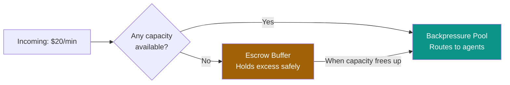

When capacity frees up, the buffer drains automatically. If the buffer itself fills up, sources get a clear signal: stop sending until things clear up.

---

## The Big Picture

Here's how all the pieces fit together in one view:

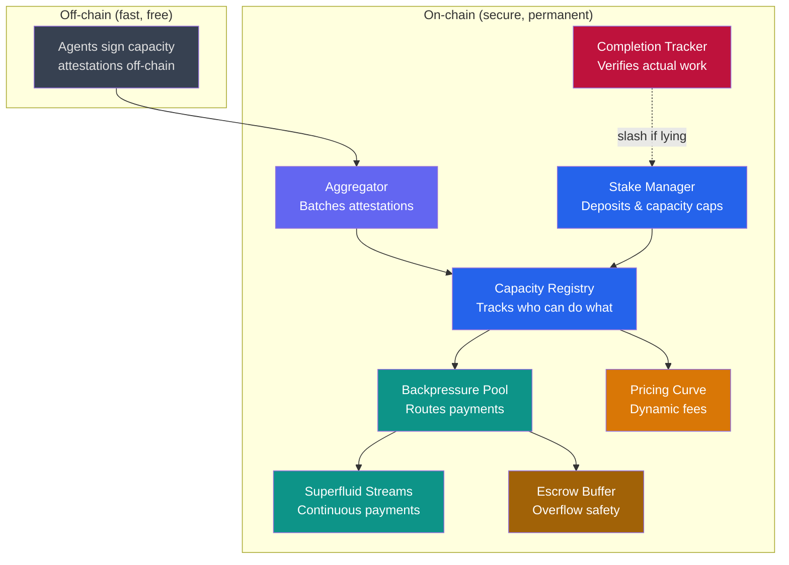

---

## Why Should I Care?

BPE matters because AI agents are starting to transact with each other autonomously, paying for compute, data, and services without humans in the loop. Today's payment systems can't handle this:

| Problem | Traditional Payments | BPE |
|---------|---------------------|-----|
| Agent gets overwhelmed | Money wasted, work unfinished | Money reroutes to available agents |
| Agent lies about capacity | No way to know | Automatic detection and penalty |
| New agent joins | Manual integration | Permissionless: just stake and register |
| Demand spikes | System breaks | Prices rise, demand balances naturally |
| Agent goes offline | Payments lost | Buffer holds funds, pool rebalances |

---

## Beyond AI Agents: Five Domains

The core BPE mechanism (declare, verify, price, route, buffer) is domain-agnostic. Anywhere there's a capacity-constrained service and a continuous payment flow, backpressure routing can improve allocation. Backproto extends BPE to five domains:

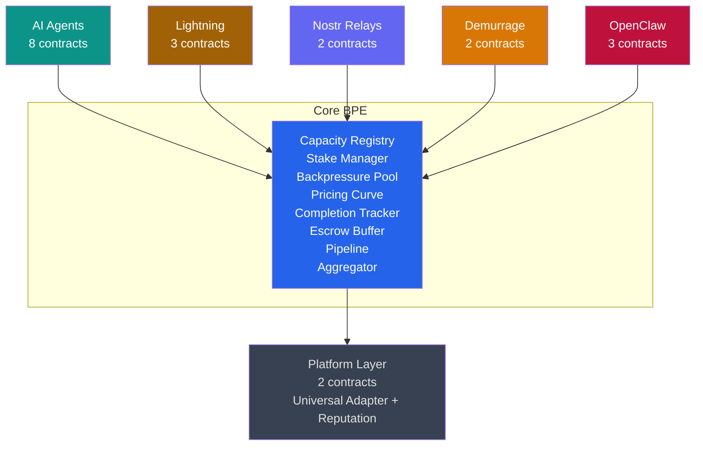

---

### Lightning Network: Better Routing Through Capacity Signals

The [Lightning Network](https://en.wikipedia.org/wiki/Lightning_Network) enables instant Bitcoin payments through a network of [payment channels](https://en.wikipedia.org/wiki/Payment_channel). But routing payments through Lightning is unreliable: senders rely on stale gossip data about channel liquidity and have to probe routes by trial and error until one works.

Backproto adds a **real-time capacity signaling layer** for Lightning, without modifying the Lightning protocol itself:

**LightningCapacityOracle.** Node operators submit signed attestations of their aggregate outbound liquidity. These reports are smoothed using [EWMA](https://en.wikipedia.org/wiki/Exponential_smoothing) (the same technique) so a single bad report doesn't swing the data. Crucially, operators only report aggregate capacity, not individual channel balances, preserving privacy.

**LightningRoutingPool.** A BPE pool where Lightning nodes are weighted by their routing capacity. Nodes with more available liquidity and balanced channels earn more streaming revenue. This creates a direct economic incentive to keep channels well-funded and balanced.

**CrossProtocolRouter.** A unified routing interface that selects the best payment protocol for each transaction:

| Protocol | Speed | Reliability | Best for |
|----------|-------|-------------|----------|
| Lightning | ~2 seconds | 95% success | Instant, small payments |
| Superfluid | ~4 seconds | 99% success | Ongoing streaming payments |
| On-chain | ~12 seconds | 99.99% success | Large, high-assurance settlements |

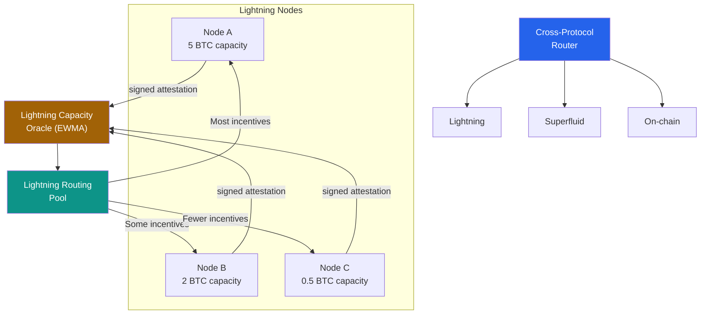

This runs on Base (L2) as a **sidecar** to Lightning. It doesn't change how Lightning works. It provides an external capacity signaling and incentive layer that pathfinding algorithms and node operators can use to make better decisions.

---

### Nostr Relays: Making Relay Operation Sustainable

[Nostr](https://nostr.com/) is a decentralized social protocol. Messages are distributed through relays, servers operated by volunteers. Most relays run at a loss or depend on donations. Users have no way to discover which relays have capacity, and relays have no way to price their services based on actual load.

Backproto adds an economic layer for Nostr relays using the same BPE primitives:

**How it works:**

1. Relay operators register and declare **multi-dimensional capacity**: throughput (events/sec), storage (GB), and bandwidth (Mbps)
2. Capacity is verified through cryptographically signed attestations, smoothed over time to prevent gaming
3. A payment pool distributes relay subscription revenue proportional to verified spare capacity
4. **Anti-spam pricing** scales with congestion: publishing events costs more on busy relays (2x at 50% load, 4x at 80%)

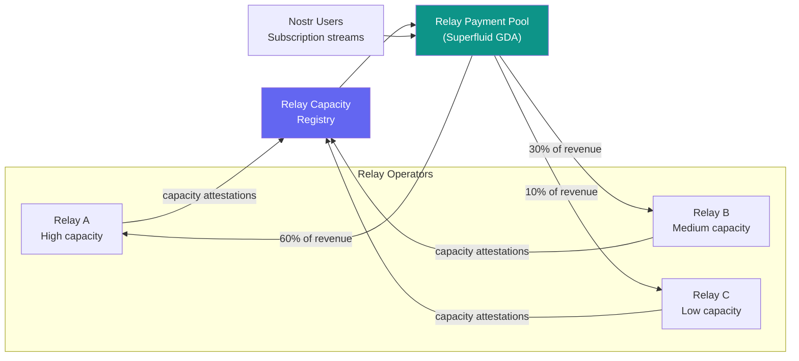

The result: relay operators who invest in real capacity earn proportionally more. Operators who overcommit get less (and get slashed). Users get a reliable discovery mechanism for quality relays. We've drafted **NIP-XX**, a Nostr Improvement Proposal to standardize this.

---

### Demurrage: Tokens That Lose Value Over Time

Most tokens just sit in wallets. In an agent economy, that's a problem: idle money means idle capacity. **[Demurrage](https://en.wikipedia.org/wiki/Demurrage_(currency))** is an old economic idea (proposed by [Silvio Gesell](https://en.wikipedia.org/wiki/Silvio_Gesell) in 1916) that puts a holding cost on currency, effectively encouraging people to spend it rather than hoard it.

Backproto implements this as the **DemurrageToken**, a token whose balance continuously decays if you hold it without using it:

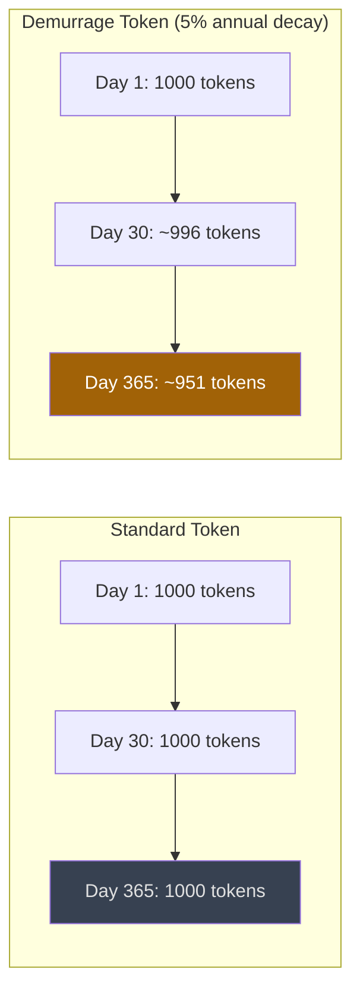

**Key details:**

- Decay is **continuous and exponential**: your balance shrinks every second you hold it idle, at a configurable rate (default: 5% per year)
- Decay only applies to **idle holdings**. Tokens locked in streaming agreements or staking contracts are exempt.
- The decayed tokens are recycled to a configurable recipient (e.g., a community treasury or the protocol itself)
- A companion contract, **VelocityMetrics**, tracks how fast tokens circulate through the economy on an hourly basis

**Why this matters for BPE:** Demurrage is the stock-side complement to BPE's flow-side mechanism. BPE routes payments efficiently to where capacity exists. Demurrage ensures those payments actually get made, because holding tokens becomes a losing strategy. The two together create stronger circulation pressure than either alone.

---

### Platform Layer: Plugging It All Together

With four different domains using BPE, there's a coordination problem: how do you share infrastructure and reputation across domains? That's what the platform layer handles.

**UniversalCapacityAdapter.** A registry of domain adapters that normalizes capacity signals from any domain into a common format the core BPE contracts understand. This means a new domain (say, decentralized storage or compute marketplaces) can plug into Backproto by registering a single adapter contract.

**ReputationLedger.** A cross-domain reputation system that makes your track record portable:

- An AI agent operator who also reliably runs a Lightning node gets credit for both
- **Negative signals weigh 3x more than positive ones**: one domain of bad behavior hurts your overall score disproportionately, making it harder for bad actors to hide behind good performance elsewhere
- Good cross-domain reputation earns **up to 50% stake discounts**: if you've proven reliable in multiple domains, you need less collateral to participate

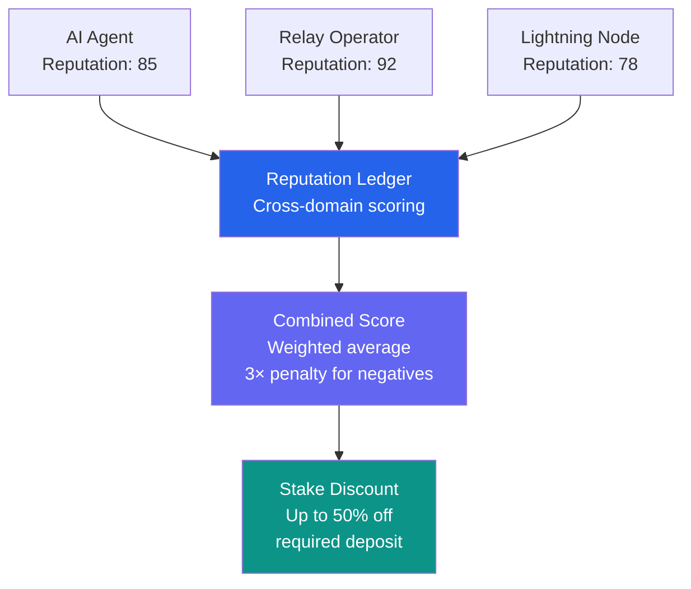

The platform layer is what turns Backproto from "a routing protocol for AI agents" into "a universal capacity coordination layer for decentralized networks."

---

### OpenClaw Agents: Coordinating Skill Networks at Scale

[OpenClaw](https://openclaw.com/) is the largest open-source AI agent framework (315k GitHub stars and growing) with ClawHub, a marketplace of installable agent skills. As OpenClaw deployments grow from single agents to multi-agent pipelines, a coordination problem emerges: which agent gets the next task, how do you verify it was completed, and how do you build trust across skill types?

Backproto adds an economic coordination layer for OpenClaw agent networks using three purpose-built contracts:

**How it works:**

1. Agent operators register with a **skill type** (e.g., research, code review, content generation) and stake tokens to declare capacity
2. The **OpenClawCapacityAdapter** translates multi-dimensional skill metrics into a single normalized score:
   - **Throughput** (tasks/epoch): weighted 50%
   - **Latency** (ms): weighted 30%, inverse-scored (lower is better)
   - **Error rate** (basis points): weighted 20%, inverse-scored
   - Scores are smoothed with EWMA (alpha=0.3) to resist gaming
3. The **OpenClawCompletionVerifier** uses EIP-712 dual-signature verification (agent + requester) to record skill executions on-chain, creating an immutable completion log
4. The **OpenClawReputationBridge** feeds completion and failure events into the cross-domain ReputationLedger, making an agent's OpenClaw track record portable to other domains

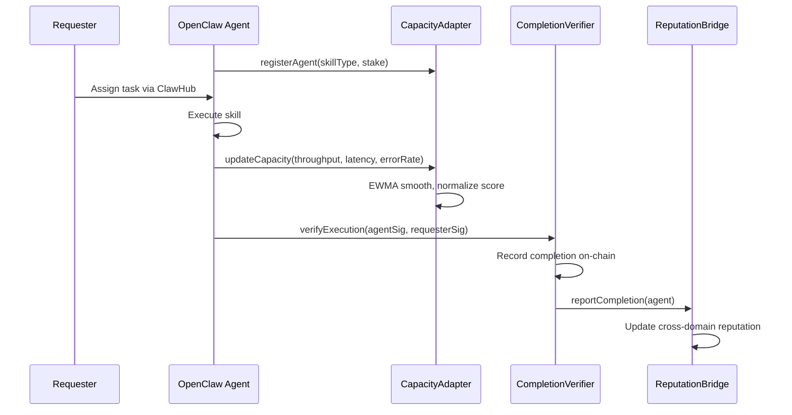

**What this enables:**

- **Capacity-weighted task routing**: When a pipeline needs a research agent, Backproto routes to the agent with the most verified spare capacity, not just the cheapest or first-available
- **Verifiable execution history**: Dual-signature completion records provide an auditable log that ClawHub can reference for dispute resolution
- **Portable reputation**: An agent's reliability in one skill category carries over to others. Strong cross-domain reputation (OpenClaw + Lightning node + Nostr relay) earns up to 50% stake discounts
- **Pipeline orchestration**: Multi-stage agent pipelines (research -> analysis -> report) can efficiently allocate each stage to available agents using Backproto's Pipeline contract

**The sidecar model**: Backproto does not modify OpenClaw's core. Agents opt in by installing a Backproto coordination skill that handles staking, capacity reporting, and completion attestation. The integration lives entirely on-chain on Base L2.

---

## How This Helps Bitcoin

If you're in the Bitcoin ecosystem, the Lightning section above is where Backproto directly contributes. Here's the full picture.

### The problem: Lightning routing is unreliable

Lightning Network payments fail more often than they should. The root cause is stale routing information. Nodes advertise channel capacity through gossip, but this data is often minutes or hours old. When you try to route a payment, you're working with an outdated map. The result: probe failures, retries, and a poor user experience that discourages adoption.

Node operators face a related problem. Keeping channels well-balanced (with liquidity on both sides) is essential for routing fees, but there's no standardized signal telling operators where demand is flowing or which channels need rebalancing.

### What Backproto adds

Backproto provides three things the Lightning ecosystem currently lacks:

**1. Real-time capacity signals.** The `LightningCapacityOracle` collects signed capacity attestations from node operators, smooths them with EWMA to resist manipulation, and makes them available on-chain. This is aggregate outbound liquidity per node, not individual channel balances, so privacy is preserved. Pathfinding algorithms can query this for fresher data than gossip provides.

**2. Economic incentives for balanced channels.** The `LightningRoutingPool` distributes streaming payment revenue to nodes proportional to their verified routing capacity. Nodes with more available liquidity earn more. This creates a direct financial incentive to keep channels funded and balanced, rather than relying on altruism or manual rebalancing.

**3. Cross-protocol settlement.** The `CrossProtocolRouter` provides a single interface that routes payments across Lightning (instant, ~2s), Superfluid streaming (continuous, ~4s), and on-chain settlement (high assurance, ~12s). This means applications can use the best protocol for each payment type without managing three separate integrations.

### The sidecar model

Critically, Backproto **does not modify the Lightning protocol**. It runs on Base (an Ethereum L2) as a sidecar, providing an external capacity signaling and incentive layer. Lightning node operators can opt in by submitting capacity attestations. Pathfinding services can query the oracle. Nothing about Lightning's core architecture changes.

This is important because the Lightning developer community is (rightly) conservative about protocol changes. Backproto offers improved routing without requiring a BOLT update, a node software fork, or consensus among Lightning implementations.

### Why this matters for Bitcoin adoption

Better routing means fewer failed payments. Fewer failed payments means a better user experience. A better user experience means more people and businesses adopt Lightning for everyday payments. The chain is direct:

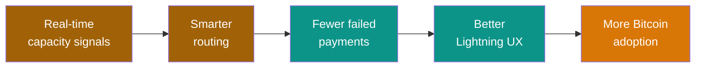

The economic incentive layer also addresses a structural problem: Lightning routing is somewhat of a public good (routers earn small fees relative to the capital they lock up). By providing streaming revenue proportional to verified capacity, Backproto makes routing more financially sustainable, which should attract more liquidity into the network.

---

## Glossary

### Core Concepts

| Term | Plain English |
|------|--------------|
| **Sink** | A service provider (AI agent, relay, Lightning node) that receives payment for doing work |
| **Source** | An app or agent that pays for work to be done |
| **Task type** | A category of work (e.g., "text generation", "image creation", "relay storage") |
| **Capacity** | How much work a service provider can handle at once |
| **Spare capacity** | The difference between declared capacity and current workload. This drives routing. |
| **Rebalance** | Updating how payments are split based on current capacity across all participants |
| **Epoch** | A time window (typically 5 minutes) for measuring performance and updating prices |
| **Pipeline** | A multi-stage chain of pools where upstream congestion propagates backward |

### Crypto and Blockchain

| Term | Plain English |
|------|--------------|
| **Token** | A programmable unit of value on a blockchain, like a digital dollar that code can move |
| **[ERC-20](https://en.wikipedia.org/wiki/ERC-20)** | The most common token standard on Ethereum. Defines how tokens are transferred, approved, and tracked. |
| **Super Token** | A Superfluid-compatible token that supports streaming (continuous per-second flows) and distribution |
| **Smart contract** | A program that lives on a blockchain and executes automatically when conditions are met |
| **Staking** | Locking up tokens as a security deposit. In BPE, agents stake to declare capacity. |
| **Slashing** | Penalty: taking part of a participant's staked deposit for dishonest behavior (e.g., claiming capacity they don't deliver) |
| **Gas** | The small fee paid for each blockchain transaction. On Base L2, gas costs are fractions of a cent. |
| **Base** | An Ethereum Layer 2 network built by Coinbase. Low fees, fast confirmations, Ethereum security. Where Backproto is deployed. |
| **Layer 2 (L2)** | A faster, cheaper blockchain that batches transactions and posts proofs to a main chain (Layer 1) for security |
| **Superfluid** | A protocol for real-time token streaming. BPE uses its General Distribution Agreement (GDA) for payment routing. |
| **GDA** | General Distribution Agreement. Superfluid's mechanism for splitting a single incoming payment stream among multiple recipients proportionally. |

### Technical Mechanisms

| Term | Plain English |
|------|--------------|
| **EWMA** | Exponentially Weighted Moving Average. A smoothing method that weights recent data more than old data, preventing sudden suspicious capacity changes. |
| **Commit-reveal** | A two-step process where you first submit a sealed (hashed) value, then reveal the actual value later. Prevents front-running. |
| **[EIP-712](https://eips.ethereum.org/EIPS/eip-712)** | A standard for signing structured data off-chain. Used for capacity attestations and completion receipts. |
| **Attestation** | A cryptographically signed statement (e.g., "I have 500 units of capacity"). Verified on-chain. |
| **Sybil resistance** | Protection against an attacker creating many fake identities. BPE's concave stake cap (square root) makes splitting unprofitable. |

### Domain-Specific

| Term | Plain English |
|------|--------------|
| **Demurrage** | A holding cost on currency that causes idle balances to decay over time, incentivizing circulation |
| **Velocity** | How fast money circulates through the economy. Measured per epoch in BPE's VelocityMetrics contract. |
| **NIP** | Nostr Implementation Possibility. A specification for how Nostr software should implement a feature. NIP-XX is our draft for relay economics. |
| **Nostr relay** | A server that stores and distributes Nostr events (messages). Currently lacks a sustainable revenue model. |
| **Lightning Network** | A layer on top of Bitcoin for instant, low-fee payments through a network of payment channels |
| **Channel capacity** | The amount of Bitcoin locked in a Lightning channel, determining how much can be routed through it |
| **Cross-protocol routing** | Selecting the best payment protocol (Lightning, streaming, on-chain) based on speed, cost, and reliability |
| **Reputation ledger** | A cross-domain scoring system that makes your track record portable across BPE domains |

---

## Want to Go Deeper?

**Academic & Formal:**

- **[Research Paper](https://backproto.io/paper)**: formal model, proofs, and evaluation
- **[Paper: Introduction](paper/introduction.md)**: problem statement and contributions
- **[Paper: Protocol Design](paper/protocol.md)**: technical details of each smart contract

**Implementation:**

- **[Smart Contracts](implementation/contracts.md)**: the Solidity code, 17 contracts deployed on Base Sepolia
- **[TypeScript SDK](implementation/sdk.md)**: build with BPE in TypeScript, 13 action modules
- **[Simulation](implementation/simulation.md)**: Python simulation showing 95.7% allocation efficiency

**Domain-Specific:**

- **[NIP-XX Specification](https://github.com/backproto/backproto/blob/main/docs/nips/NIP-XX-backpressure-relay-economics.md)**: the Nostr relay economics standard
- **[GitHub Repository](https://github.com/backproto/backproto)**: all code, MIT licensed
